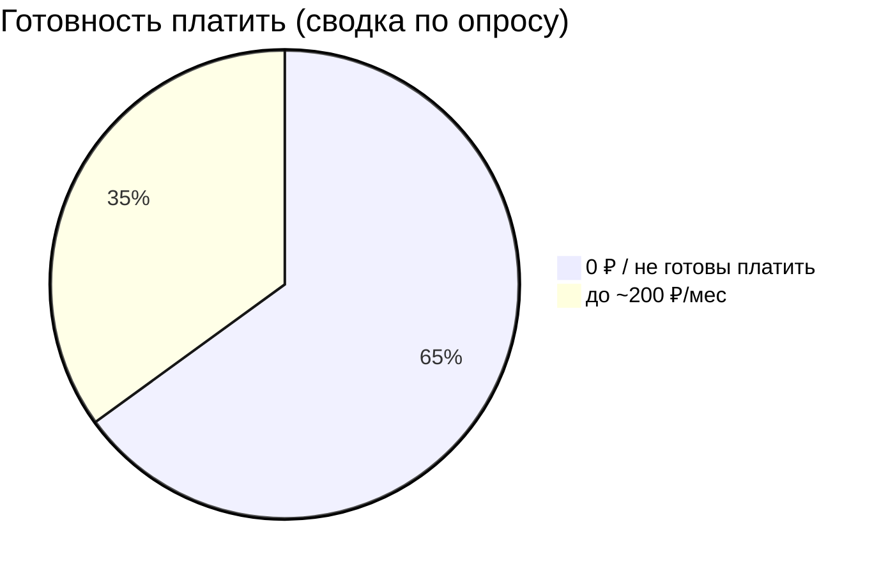

# AI Task Manager — итоговый проект (мы)

## 0) Коротко о проекте
Мы — команда из 2 человек. Делаем учебный MVP по курсу “Технологическое предпринимательство”.

**Продукт:** Telegram-бот для задач. Пользователь пишет текстом (или голосом), бот с помощью AI выделяет задачу и время, сохраняет и ставит напоминание.

---

## 1) Проблема и ценность (что болит)
**Проблема:** люди часто фиксируют задачи “в голове” или в разных местах (телефон, бумага, заметки). Из-за этого:
- забывают задачи,
- вспоминают в последний момент,
- стрессуют из-за дедлайнов,
- тратят время на организацию.

**Ценность решения:** записать задачу “на ходу” за 5–10 секунд прямо в Telegram и получить понятное напоминание. AI помогает превращать обычную фразу в структурированную задачу.

---

## 2) JTBD (Jobs To Be Done)
**Работа пользователя:** “не забывать важные задачи и доводить их до выполнения”.

**Когда это особенно нужно:**
- когда идёшь/едешь и нужно быстро записать;
- когда много мелких дел;
- когда не хочется открывать отдельные приложения и долго планировать.

JTBD удобен тем, что люди покупают не “бота”, а результат. В нашем случае результат — **не забыть задачу и довести до выполнения**, особенно когда задача появилась внезапно.  
Через JTBD мы понимаем: что должно быть в MVP обязательно (быстро записать и напомнить), а что можно позже (интеграции, сложная аналитика).

---

## 3) ЦА, сегменты и города

### 3.1 Сегменты
1) **Студенты (18–23)**  
Много задач по учёбе/быту, Telegram — основной мессенджер, чувствительны к цене.

2) **Студенты, которые ещё и работают / фрилансеры**  
Задач больше, выше ценность напоминаний и быстрого ввода, готовы платить, если реально экономит время.

3) **Организованные пользователи (мини-команды/менеджеры)**  
Чаще готовы платить за “безлимит” и расширенные функции → это аудитория для Premium+.

### 3.2 География
Фокус на **крупные города РФ** (Москва, СПб, Казань, Екатеринбург, Новосибирск и т.д.), потому что:
- выше проникновение Telegram;
- выше цифровые привычки (заметки, сервисы, подписки);
- проще запускаться через студенческие/тематические Telegram-каналы.

---

## 4) Исследование: опрос (≈50 ответов)

Источник: файл `Новая форма (Ответы) - Ответы на форму (1).csv`.

### 4.1 Чистка данных (это важно для защиты)
В опросе встречались нерелевантные/шутливые ответы (спам). Мы их исключили, потому что:
- ответ не про задачи/планирование,
- бессмысленный набор слов,
- нет ключевых полей.

Так делают в реальной аналитике, когда опрос открытый.

### 4.2 Что выяснили
По валидным ответам видно:
- чаще всего задачи фиксируют через **телефон/напоминания** или **держат в голове**;
- если забывают задачу — это “вспомнил в последний момент”, “неприятно”, “дедлайн”;
- главные ожидаемые функции: **напоминания**, **список задач**, **кнопка выполнено**, **сортировка/категории**, **быстрый ввод**.

### 4.3 Готовность платить (сводка)
У нас из заметок есть итог:
- ~65% не готовы платить,
- ~35% готовы платить до ~200 ₽/мес.

Важно: “готов платить” ≠ “купит”, поэтому в юнит-экономике конверсия в оплату ниже (2–5%).

---

## 5) Рынок и конкуренты (логика цен)
Мы ориентируемся на рынок менеджеров задач и подписок.

**Рыночный диапазон (ориентир):**
- базовые планы: ~199–299 ₽/мес
- расширенные: ~399–599 ₽/мес

---

## 6) Ценообразование и юниты (несколько уровней — чтобы модель была устойчивее)
Мы выбрали **Freemium**, потому что большинство на старте не готово платить.

### Юниты монетизации
1) **Free (0 ₽)**  
Лимит по AI/голосу/кол-ву задач. Нужен, чтобы пользователь “подсел” и понял ценность.

2) **Premium — 199 ₽/мес**  
Цена попадает в “порог до 200 ₽” из опроса.

3) **Premium+ — 499 ₽/мес**  
Для тех, кому важны “безлимиты” + голос + более сильный AI. Нужен, чтобы повышать LTV.

4) **One-time Pro — 399 ₽ (разово)**  
Для тех, кто не любит подписки: разовая покупка доп. функции (экспорт/статистика/пакет возможностей).

---

## 7) Модель Кано (почему и как применили)
**Базовые:** сохранение задач, стабильность, чтобы ничего не терялось.  
**Ожидаемые:** напоминания, список задач, выполнено, сортировка.  
**Восхищающие:** AI-структурирование задач и голосовой ввод.

Вывод: MVP = базовые + ожидаемые, AI/голос — как преимущество, но не вместо надежности.

---

## 8) Каналы продвижения (почему Telegram)
Telegram — лучший канал, потому что продукт находится там же:
- меньше шагов от рекламы до использования;
- проще тестировать гипотезы через посевы в каналах;
- наша аудитория (студенты/молодые работающие) реально там.

---

## 9) Юнит-экономика
### 9.1 Входные допущения на месяц (тест MVP)
- **UserAcq = 1000** пользователей пришли в бота за месяц (запустили/начали использовать).
- **Marketing = 50 000 ₽** тестовый бюджет.
- **CPA = 50 ₽** за пользователя (50 000 / 1000).
- **ConversionPay = 3%** (реалистично для MVP; ниже чем “готов платить”).
- **Buyers = 30** платящих (1000 × 3%).

### 9.2 Микс платящих (юниты)
Из 30 платящих:
- Premium 199: 24 (80%)
- Premium+ 499: 5 (15%)
- One-time 399: 1 (5%)

### 9.3 COGS (себестоимость) — объяснение цифр
Premium:
- AI API 10 ₽ + сервер 5 ₽ + эквайринг 8 ₽ = **23 ₽/мес**

Premium+:
- AI/голос 15 ₽ + сервер 5 ₽ + эквайринг 20 ₽ = **40 ₽/мес**

One-time:
- эквайринг + обработка = **10 ₽**

### 9.4 Выручка и маржа за 1 месяц
Revenue:
- 24×199 = 4 776 ₽
- 5×499 = 2 495 ₽
- 1×399 = 399 ₽  
**Итого Revenue = 7 670 ₽**

COGS:
- 24×23 = 552 ₽
- 5×40 = 200 ₽
- 1×10 = 10 ₽  
**Итого COGS = 762 ₽**

**Gross Profit (валовая прибыль) = 6 908 ₽**

CAC платящего:
- CAC = 50 000 / 30 ≈ **1 667 ₽**

Вывод: себестоимость маленькая, но на платной рекламе платящий получается дорогим → нужно снижать CPA и повышать удержание/конверсию.

---

## 10) Потоки денег
**Входящий поток:** подписки Premium/Premium+, разовая покупка.  
**Исходящий поток:** маркетинг, эквайринг, AI API, сервер/инфраструктура, фикс расходы.

Формула:
Revenue → минус COGS → Gross Profit → минус Marketing → итог месяца.

---

## 11) Итоговое заключение
Проект жизнеспособен как MVP (боль понятная, Telegram подходит, спрос на быстрый ввод есть).  
Главный риск — высокая стоимость привлечения платящего на старте. Поэтому стратегия роста:
- freemium + ограничения для бесплатных,
- органика/рефералы,
- повышение retention (чтобы платили дольше),
- увеличение доли Premium+.

---

## 12) Шпаргалка (коротко отвечать на вопросы)
**Почему 199 ₽?** У части аудитории порог “до 200 ₽”, и это рыночный уровень базовых подписок.  
**Почему 1000?** Это не платящие, а привлечённые пользователи за месяц.  
**Почему 3% платящих?** “Готов платить” по опросу — верхняя граница, реальная покупка ниже; 2–5% типично для MVP, берём 3%.  
**Почему COGS 23/40 ₽?** AI+сервер+эквайринг, у цифрового продукта низкая себестоимость.  
**Почему несколько юнитов?** Freemium даёт охват, Premium монетизирует, Premium+ увеличивает LTV, one-time для тех кто не любит подписки.
