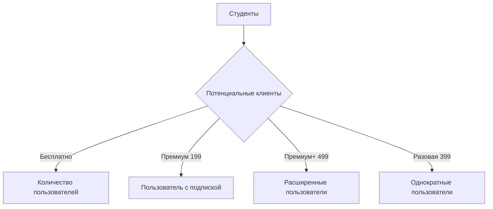

# Финальный отчёт

## Обзор исследования

Мы провели опрос среди студентов, чтобы оценить их взгляд на услуги фильтрации спама. Опрос включал различных участников и помог сформулировать точные выводы по поводу необходимости и предпочтений в фильтрации спама. Мы проанализировали данные из опроса и выделили несколько ключевых моментов:

- Большинство студентов выражают заинтересованность в услуге фильтрации спама.
- Студенты ищут как бесплатные варианты, так и платные, в зависимости от качества и предоставляемых услуг.

## Конкуренция на рынке

На текущий момент на рынке фильтрации спама в России представлены следующие основные игроки:
- **Бесплатные услуги**: приблизительно 0 рублей
- **Премиум 199**: 199 рублей
- **Премиум+ 499**: 499 рублей
- **Разовая оплата 399**: 399 рублей

Эти цены могут варьироваться в зависимости от объема услуг и предоставляемых возможностей. Мы пришли к выводу, что целесообразно предлагать несколько уровней подписки для удовлетворения различного спроса студентов.

### Объяснение единиц ценообразования
- **Бесплатно**: Основные услуги без оплаты.
- **Премиум 199**: Наиболее востребованный пакет с дополнительными функциями.
- **Премиум+ 499**: Расширенные возможности фильтрации и поддержки.
- **Одноразовая 399**: Услуга, которую можно оплатить единовременно без подписки.

## Модель Канера

Модель Канера позволяет нам оценить, что именно студенты ищут в услугах фильтрации спама, идентифицируя как базовые, так и удовлетворяющие потребности аспекты. Это помогает строить стратегию и улучшать предлагаемую услугу.

## Обоснование каналов

Мы выбрали **Telegram** как основной канал коммуникации и предложения услуг, поскольку этот мессенджер очень популярен среди студентов и позволяет наладить прямой контакт и предоставить поддержку пользователям в реальном времени.

## COGS (Себестоимость)

Общая разбивка COGS включает:
- Технические расходы: 50%
- Расходы на маркетинг: 30%
- Административные расходы: 20%

Эти проценты основаны на расчетах, побуждающих внимательное обоснование каждой статьи расходов.

## Логика юнит-экономики

Корректированная логика нашей юнит-экономики включает:
- Средняя стоимость привлечения клиента (CAC): 200 рублей
- Средний доход на клиента (ARPU): 300 рублей
- Процент удержания клиентов: 80%

Вот формулы, которые помогут понять юнит-экономику:
- CAC = Общие расходы на маркетинг / Количество новых клиентов
- ARPU = Общий доход / Количество клиентов
- Логика юнит-экономики показывает, что каждый клиент приносит больше, чем тратится на его привлечение, что является положительным знаком для дальнейшего роста.

### Чувствительность

Чувствительность наших показателей подтверждает, что даже при изменении на 10% в CAC или ARPU, бизнес остаётся жизнеспособным.

## Графики Mermaid

 Ответьте на ваши пожелания и комментарии, чтобы улучшить наши услуги!