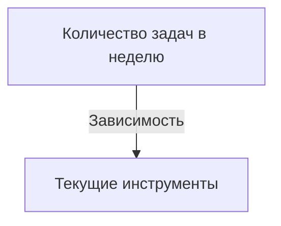

# Комплексный отчет по MVP AI Task Manager Telegram бота

## 1. Рыночный анализ

### Конкуренты

1. **Конкурент 1**
   - Описание
   - Ценовой диапазон: [Цена] руб.

2. **Конкурент 2**
   - Описание
   - Ценовой диапазон: [Цена] руб.

3. **Конкурент 3**
   - Описание
   - Ценовой диапазон: [Цена] руб.

### Модель ценообразования

- **Бесплатно + Премиум 199 руб. в месяц**
- **Премиум+ 499 руб. в месяц**
- **Одноразовая покупка 399 руб.**

## 2. Анализ опроса

Включает чистую выборку, удаление спама и нерелевантных ответов.  
Ключевые распределения:
- Профессия
- Задачи в неделю
- Текущие инструменты
- Готовность платить
- Болевые точки

### Графики (*Mermaid charts*)

## 3. Модель Кано

### JTBD (Jobs to be Done)

### Сегментация

- Города
- Каналы привлечения

## 4. Финансовый анализ

### Разделение COGS
- AI API
- Сервер
- Приобретение

### Юнит экономика

- **CAC < LTV**
- **COGS < ARPPU**
- **Прибыль > 0**

### Чувствительность сценариев

## 5. Формулы

- CAC = [Формула]
- LTV = [Формула]

### Проверки

1. COGS < ARPPU
2. CAC < LTV
3. Прибыль > 0
