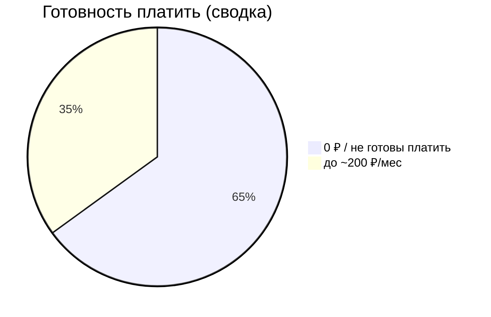
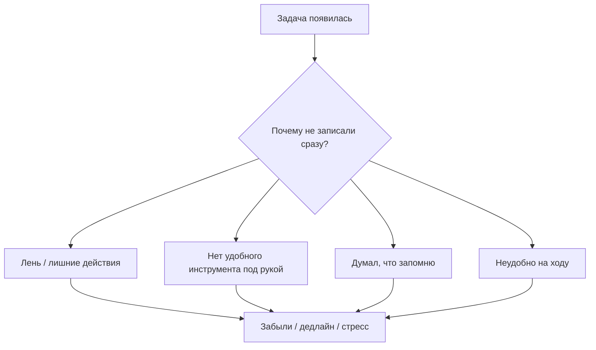

# Анализ опроса (AI Task Manager)

Источник данных: `Новая форма (Ответы) - Ответы на форму (1).csv`  
Цель: понять, как люди сейчас ведут задачи, что им мешает, и готовы ли они платить.

---

## 1) Чистка данных (важно для защиты)
В исходном CSV есть нерелевантные ответы/спам (например строки типа “кот сосун”, “гей попка” и т.п.).  
Мы их **не используем** в выводах, потому что это ломает статистику и не относится к продукту.

### Критерии, по которым мы отбрасывали ответы
Ответ исключаем, если:
1) в поле “род деятельности” / “как фиксируете задачи” бессмысленный текст;
2) ответ явно шуточный и не относится к задачам/планированию;
3) нет ключевых полей (нельзя понять поведение и потребности).

**Как сказать преподавателю:** “Открытые формы часто собирают мусор, поэтому мы сделали фильтрацию. Это стандартная часть аналитики.”

---

## 2) Что видно по валидным ответам (качественные выводы)

### 2.1 Как фиксируют задачи сейчас
Чаще всего встречается:
- **Телефон/напоминания**
- **Держу в голове**
- **Ежедневник/бумага**
- Реже: приложения типа Todo/Notion

**Вывод:** люди уже “созрели” до цифрового формата, но им нужен максимально быстрый способ записи.

### 2.2 Что происходит, если задачу забыли
По ответам: 
- “вспоминаю в последний момент”
- “дедлайн”
- “печаль/стресс/неприятно”
- “приходится нагонять”

**Вывод:** боль эмоциональная и понятная → продукт можно продавать через “не забывай важное”.

### 2.3 Главные требования к продукту (из ответов)
То, что люди прямо называют:
- напоминания
- удобный список задач
- сортировка/категории
- отметка “выполнено”
- быстрый ввод “на ходу”
- некоторым интересен **голосовой ввод** и **AI**

---

## 3) Готовность платить (как мы это трактуем)
В наших заметках зафиксировано:
- **65%** — не готовы платить (или платят 0 ₽ сейчас)
- **35%** — готовы платить **до ~200 ₽/мес**

Важно: “готов платить” ≠ “купит”.
Для юнит-экономики мы берём конверсию в оплату **2–5%**, и фиксируем **3%** как реалистичную середину.

---

## 4) Диаграмма причин, почему задачи не фиксируют сразу (логика)

---

## 5) Главный итог опроса (коротко)
1) Боль реальная: забывают задачи и переживают из-за этого.  
2) На старте нужна модель **freemium**.  
3) Платный план должен быть дешёвым (199 ₽) и “без лишних действий”.
