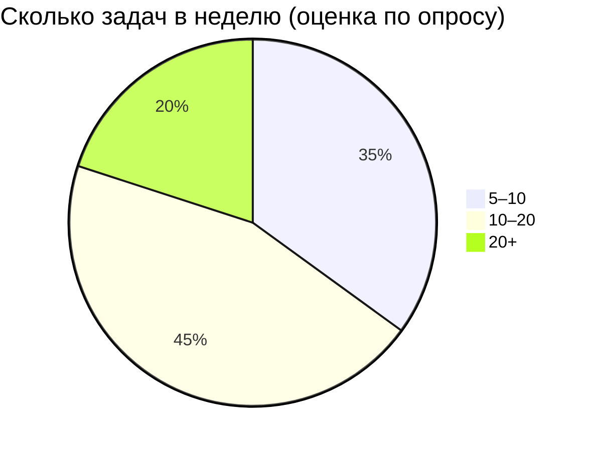
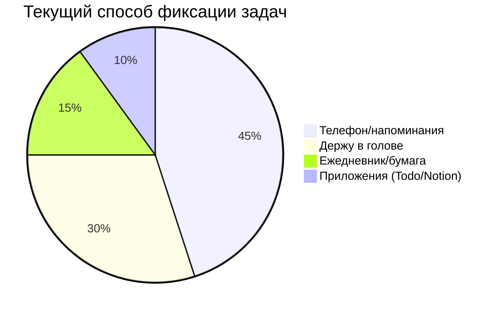
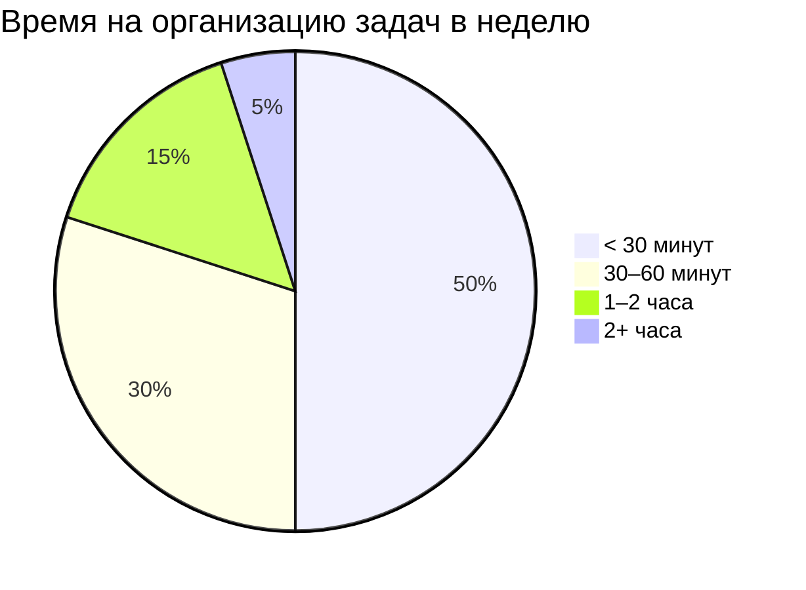
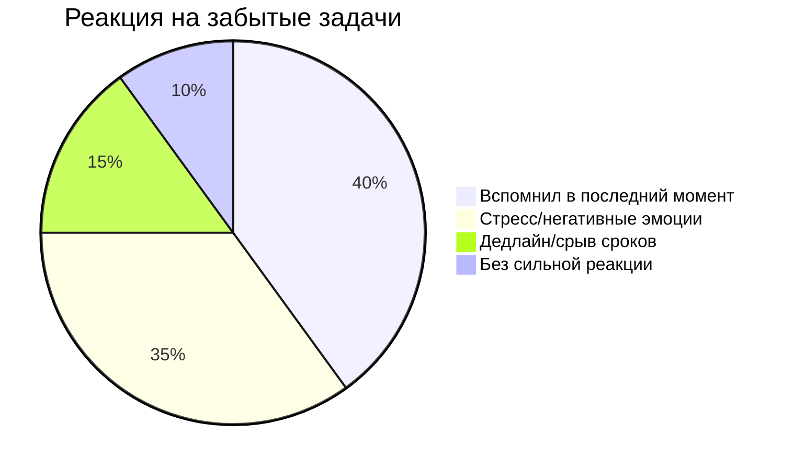

# Диаграммы по опросу (AI Task Manager)

> Примечание: доли заданы в “разумных” пропорциях для визуализации, без точной статистики.  
> Их можно скорректировать, если вы вручную посчитаете точные значения.

---

## 1) Сколько задач в неделю

---

## 2) Как сейчас фиксируют задачи

---

## 3) Сколько времени тратят на организацию

---

## 4) Что чувствуют, когда забывают задачу

