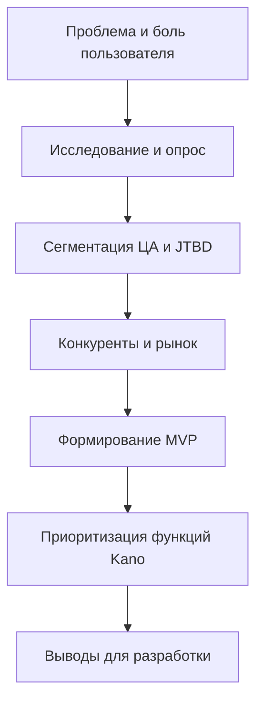

# Главы 4–6: схема, описание и выводы по приоритетам функций

Цель: показать, как мы прошли по этапам (проблема → рынок → продукт → приоритизация), и вывести, какие функции делать первыми.

---

## 1) Схема (логика глав 4–6)

---

## 2) Описание этапов (коротко по сути)

### 2.1 Проблема и боль
Пользователи держат задачи в голове или в разных местах. Это приводит к забыванию, стрессу и срыву сроков.

### 2.2 Исследование и опрос
Опрос подтвердил:
- задачи часто фиксируют в телефоне/голове,
- при забывании — стресс/дедлайны,
- важны напоминания, быстрый ввод, список задач.

### 2.3 Сегментация и JTBD
Мы выбрали JTBD, чтобы понять реальную “работу” пользователя:
> “Когда задача появляется на ходу, я хочу быстро её зафиксировать, чтобы не забыть.”

### 2.4 Конкуренты и рынок
Цены на базовые планы обычно в районе 199–299 ₽, расширенные — 399–599 ₽.  
Для старта нужна модель freemium.

### 2.5 MVP
MVP должен закрывать:
- быстрое создание задачи,
- корректное напоминание,
- возможность довести до выполнения (статусы/списки).

### 2.6 Kano → приоритеты
Мы классифицируем функции:
- **Must-have** (без них продукт не нужен),
- **Performance** (улучшают удобство),
- **Delighters** (приятные “фишки”).

---

## 3) Приоритеты разработки функций (вывод)

### Must-have (делаем первым)
- создание задачи одной строкой  
- уточнение времени (pending‑логика)
- авто‑напоминания  
- список задач (/list, /today, /done)  
- статусы задач (todo/in_progress/done + кнопки)

### Performance (после стабильного MVP)
- приоритеты задач  
- редактирование текста  
- перенос напоминаний  
- удаление задач  

### Delighters (когда база стабильна)
- голосовой ввод  
- AI fallback для времени  
- расширенная аналитика задач  

---

## 4) Итог
Приоритеты определены так, чтобы сначала закрыть основной JTBD  
(«быстро записать и не забыть»), а затем добавлять удобство и “вау‑фичи”.