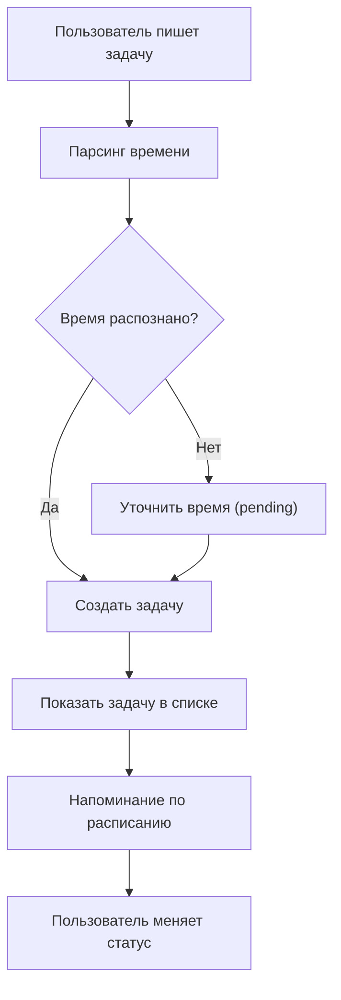

```mermaid
flowchart TD
  A["Пользователь пишет задачу"] --> B["Парсинг времени"]
  B --> C{Время распознано?}
  C -- "Да" --> D["Создать задачу"]
  C -- "Нет" --> E["Уточнить время (pending)"]
  E --> D
  D --> F["Показать задачу в списке"]
  F --> G["Напоминание по расписанию"]
  G --> H["Пользователь меняет статус"]
```

